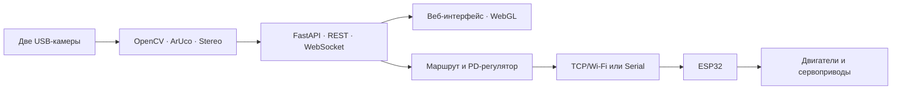

<div align="center">

# КарьерА

**Компьютерное зрение, 3D-стереокарта и управление роботами на макете карьера**

[](https://github.com/r9032813111-debug/KarierA/actions/workflows/ci.yml)


</div>

`КарьерА` объединяет две USB-камеры, OpenCV/ArUco, браузерную 3D-визуализацию
и контроллеры ESP32. Оператор видит поле в реальном времени, назначает роли
меткам, выбирает робота и отправляет его к точке; backend строит безопасный
маршрут и передаёт команды движения по локальной сети.

## Возможности

- распознавание ArUco `DICT_4X4_100` и автоматическое восстановление геометрии поля;
- координаты и курс нескольких роботов с динамическим выбором активного агента;
- построение маршрутов внутри рабочих зон и обход запрещённых областей;
- четыре режима стереозрения: `3D ARUCO`, `3D БЕЗ МЕТОК`, `RGBD 2D` и `SUPERFAST 2D`;
- встроенный WebGL-просмотр поверхности без отдельного окна PyVista;
- ручное управление `W/A/S/D`, индивидуальные PD-настройки и сервоприводы;
- аварийный стоп, контроль потери связи и watchdog на ESP32;
- полный калибратор пары камер с сохранением YAML/JSON;
- REST API, WebSocket-синхронизация и MJPEG-поток в одном FastAPI-приложении.

## Архитектура



| Уровень | Технологии |
| --- | --- |
| Машинное зрение | OpenCV, ArUco, NumPy, стереоректификация |
| Backend | Python 3.12, FastAPI, Uvicorn, WebSocket |
| Интерфейс | HTML, CSS, JavaScript, WebGL |
| Робот | ESP32, Arduino framework, PlatformIO, TCP/Serial |
| Проверки | 47 unit-тестов, Python compile check, сборка прошивки в CI |

## Быстрый запуск

Проект проверен на Windows с Python `3.12`. Для стереорежима нужны две USB-камеры;
для прошивки контроллера — PlatformIO и совместимая плата ESP32.

### Вариант для Windows

```text
INSTALL.bat
START_KARIERA.bat
```

После запуска откройте [http://localhost:8000](http://localhost:8000).

### Запуск вручную

```powershell
git clone https://github.com/r9032813111-debug/KarierA.git
cd KarierA
py -3.12 -m venv .venv
.\.venv\Scripts\Activate.ps1
python -m pip install --upgrade pip
python -m pip install -r requirements.txt
python -m uvicorn backend.main:app --host 127.0.0.1 --port 8000
```

Чтобы открыть интерфейс другим устройствам доверенной локальной сети, замените
`127.0.0.1` на `0.0.0.0` и используйте IP компьютера с камерой.

Для просмотра интерфейса без оборудования временно установите
`hardware_enabled: false` и `stereo_enabled: false` в `backend/hardware.yaml`.

## Настройка оборудования

### 1. Камеры и транспорт

Основные параметры находятся в `backend/hardware.yaml`:

- индексы, разрешение и backend камер;
- словарь и физический размер ArUco-меток;
- режим Wi-Fi/Serial и порт связи;
- размеры поля, допуски и ограничения регулятора;
- параметры стереорасчёта.

Текущая `stereo_calibration.yaml` относится к конкретной паре камер. После
замены камер, объективов, разрешения или взаимного положения выполните новую
калибровку.

### 2. Wi-Fi ESP32

Реквизиты сети не хранятся в Git. Создайте локальный файл из шаблона:

```powershell
Copy-Item firmware\esp32\include\wifi_credentials.example.h `
  firmware\esp32\include\wifi_credentials.h
```

Заполните `WIFI_SSID` и `WIFI_PASSWORD`, затем соберите и загрузите прошивку:

```powershell
pio run --project-dir firmware\esp32
pio run --project-dir firmware\esp32 --target upload
pio device monitor --baud 115200
```

После подключения платы задайте выданный ей LAN IP у нужного агента в разделе
меток веб-интерфейса.

### 3. Калибровка стереопары

Запустите:

```text
CALIBRATE_STEREO.bat
```

Используется шахматная доска `7 × 6` внутренних углов с клеткой `22.8125 мм`.
Снимите не менее 20 разнообразных ракурсов: `C` сохраняет пару, `Space`
рассчитывает и записывает калибровку, `R` очищает набор, `Q` завершает работу.

## Проверка проекта

```powershell
python -m unittest discover -s tests -v
python -m compileall -q backend calibration_program stereo_source tests
pio run --project-dir firmware\esp32
```

На момент публикации проходят все `47` unit-тестов, а прошивка успешно собирается
для `esp32dev`. Эти же проверки запускаются автоматически в GitHub Actions.

## Структура

```text
KarierA/
├── backend/                 # API, зрение, маршруты и управление роботом
├── frontend/                # веб-интерфейс и 3D/WebGL
├── firmware/esp32/          # основная прошивка контроллера
├── calibration_program/     # интерактивная калибровка стереопары
├── stereo_source/           # алгоритмы глубины и построения поверхности
├── tests/                   # unit-тесты backend и стереорежимов
├── CALIBRATE_STEREO.bat
├── START_KARIERA.bat
└── requirements.txt
```

Файлы `configuration.json`, `regions.json`, `controller_settings.json`,
`servo_settings.json` и `stereo_settings.json` создаются во время работы и
намеренно не публикуются. То же относится к логам, кэшу Python, `.pio/`,
резервным калибровкам и локальным Wi-Fi-реквизитам.

## Безопасность

Система управляет физическими приводами. Первую проверку прошивки выполняйте с
поднятыми колёсами и доступным аппаратным отключением питания. Backend и TCP-порт
ESP32 не имеют аутентификации, поэтому запускайте их только в доверенной
изолированной сети и не пробрасывайте порты в интернет.
